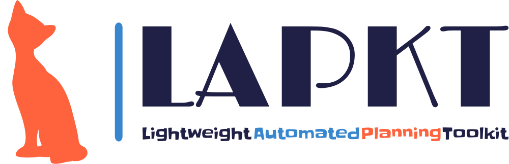

<!---  --->

The NOS&reg; logo is a registered trademark of the Nitrous Oxide Systems (NOS) company and is used here for illustrative purposes only (because it looks cool). The work presented here is in no way affiliated to the Nitrous Oxide Systems (NOS) company.

This repository contains a modified version of LAPKT-2.0 that implements the **BFNoS (Best First Novelty Search)** planner, as described in the paper [_Count-based Novelty Exploration in Classical Planning_](https://doi.org/10.3233/FAIA240990), presented at the _27th European Conference on Artificial Intelligence_ (ECAI). Following is a brief introduction to run the model and modify the various features.

<ins>**Versions**
- The **ecai24** branch contains the version of BFNoS specified in the [paper](https://doi.org/10.3233/FAIA240990).
- The **main** branch includes additional improvements that may be added to the model over time. Currently these improvements include:
	- _Open-list partitioning of novelty_: Improves coverage of both stand-alone BFNoS and dual-planner configurations by ~10 instances compared to the ecai24 version, in the same benchmark used in the paper.

<ins>**Installation**

Build LAPKT by following the [Build instructions](developersguide/build.md). It is **required to also install the Tarski parser and grounder for this solver**, as described in the developers guide. Even though the FD grounder is used by default, LAPKT currently does not support axioms produced by the FD grounder for a small number of problems, and in such cases it automatically detects the axioms and falls back to the Tarski grounder.

**Important**: Additional requirements before building.

- Update submodule, run from base directory:
		
		git submodule update --init --recursive
	
	This is because *external_package/fd_translate* was updated compared to the main LAPKT 2.0 repo.

- Also required for build:
	
		sudo apt install python-is-python3
	
	Because somewhere in the new _fd_translate_ files, _python_ is used instead of _python3_, so this is a suboptimal and temporary fix.

<ins>**Run the $BFNoS_t(f_5(C_1),f_5(W_2))$ solver with FD grounder:**

	python3 lapkt_package/lapkt.py BFWS --grounder FD -d <domain> -p <problem> --search_type BFNOS [options]

   	Options:
      -- time_limit [int]		Memory threshold in MB, 0 is no threshold (default: 0).
      -- memory_limit [int]		Time threshold in seconds, 0 is no threshold (default: 0).
      -- fallback_backend		Fallback to backend planner for dual-solver configuration (default: off).
      -- backend_type [string]	Specify backend type (default: DUAL-BFWS). Other option is EXTERNAL.
      -- tol_max_depth [int]	Trimmed open list max depth (default: 18).
      -- tol_seed [int]		Trimmed open list seed (default: 42).

<ins>**BFNoS External Backend Fallback**

The `--fallback_backend` command allows BFNoS to be used as a front-end solver that falls back to a backend planner when exceeding the preset time or memory budget. Using an external backend planner requires `--backend_type EXTERNAL`. This will return a specific exit code if the frontend solver terminates without finding a solution, which may be caught by an external script to launch the backend solver. Default error code is 14. The code may be set at **line 367** in [src/planner/bfws/bfws.cxx](src/planner/bfws/bfws.cxx):

	std::exit(14); //for external backend planners

<ins>**Experiments**

We recommend using [Lab](https://lab.readthedocs.io/en/stable/index.html) for conducting experiments.

AUTHORS
-------

- Giacomo Rosa <rosag@student.unimelb.edu.au>
- Nir Lipovetzky <nirlipo@gmail.com>

CITE
----

- G. Rosa and N. Lipovetzky. Count-based Novelty Exploration in Classical Planning. In _Proceedings of the 27th European Conference on Artificial Intelligence_, vol. 392, pp. 4181-4189, 2024.

		@inproceedings{rosa2024count,
		  title={Count-based novelty exploration in classical planning},
		  author={Rosa, Giacomo and Lipovetzky, Nir},
		  booktitle={Proceedings of the European Conference on Artificial Intelligence},
		  volume={392},
		  pages={4181--4189},
		  year={2024}
		}

LAPKT
=====

LAPKT aims to make your life easier if your purpose is to create, use or extend basic to advanced Automated Planners. It's an open-source Toolkit written in C++ and Python with simple interfaces that give you complete flexibility by decoupling parsers from problem representations and algorithms. It has been succesfully used in embedded systems, webservices, compilations, replanning and contains some of the high-performance planners from the last International Planning Competition 2014.

AUTHORS
=======

- Miquel Ramirez <miquel.ramirez@gmail.com>
- Nir Lipovetzky <nirlipo@gmail.com>
- Anubhav Singh <anubhav.singh.er@protonmail.com>
- Christian Muise <christian.muise@gmail.com>

OVERVIEW
===========

LAPKT separates search engines from the data structures used to represent
planning tasks. This second component receives the name of 'interface' since
it is indeed the interface that provides the search model to be solved.

Search engine components are meant to be modular, allowing users of LAPKT to
assemble and combine features of different search engines to come up with customized
search strategies, within reason and without sacrificing (much) efficiency. In order to
do so, LAPKT makes heavy use of C++ templates and the Static Strategy design pattern.
At the time of writing this, the modularity and decoupling of components isn't as high 
as I would like, there's still a lot of work to do :)

LAPKT is bound to change rapidly and dramatically over the next months, so please keep
this in mind when using this library.

Pypi package(linux and windows): Jump right in!
=================================================
- Install package

		python3 -m pip install lapkt

- Checkout lapkt options

		lapkt_cmd.py -h

The python script can be found [here](https://github.com/LAPKT-dev/LAPKT-public/blob/Devel2.0/src/python/_package/script/lapkt_cmd.py)
### *Note* - as of Oct 2022 `pypi` package for `macos` is `work in progress` 

## Important platform requirements:

**Platform agnostic**

1. The directory where the `pip` command installs the scripts, including `lapkt_cmd.py`, is generally on the system `PATH`, if not, it needs to be added manually.
2. Python version [ `3.7`, `3.7`, `3.8`, `3.9`, `3.10` ] are supported

**@Windows**

1. `clingo/gringo` python package requires `MSVCP140.dll` which comes with visual studio redistributable. [latest vc-redist](https://docs.microsoft.com/en-us/cpp/windows/latest-supported-vc-redist)
2. To be able to run `lapkt_run.py` script directly from command line, change the default handler for ".py" files to `Python'.

Introduction to LAPKT 4 Devs
================================

[Build instructions](developersguide/build.md)

`cmake` is the primary tool used to build the LAPKT's C++(backend) source code. We also use it to generate Python/C++ library package which is ready to go as a `pypi` package. 

# Publications

## Approximate Novelty Search

Approximate Novelty Search in which we iteratively run approximate BFWS(f5) with novelty based pruning, sequentially increasing the number of novelty categories W at each iteration.

	Singh, Anubhav, Nir Lipovetzky, Miquel Ramirez, and Javier Segovia-Aguas. 
	"Approximate novelty search." ICAPS, vol. 31, pp. 349-357. 2021.

# Apptainer Configurations

1. Approximate Novelty Search

[Agile 1 Apptainer configuration](Apptainer.ApxNovelty)

	apptainer build ApxNovelty.sif  Apptainer.ApxNovelty

2. Grounding Schematic Representation with GRINGO for Width-based Search leverages [Tarski](https://tarski.readthedocs.io/en/latest/notebooks/grounding-reachability-analysis.html)

[Agile 2 Apptainer configuration](Apptainer.ApxNoveltyTarski)

	apptainer build ApxNoveltyTarski.sif  Apptainer.ApxNoveltyTarski

[Satisficing Apptainer configuration](Apptainer.ApxNoveltyAnytime)

	apptainer build ApxNoveltyAnytime.sif  Apptainer.ApxNoveltyAnytime
